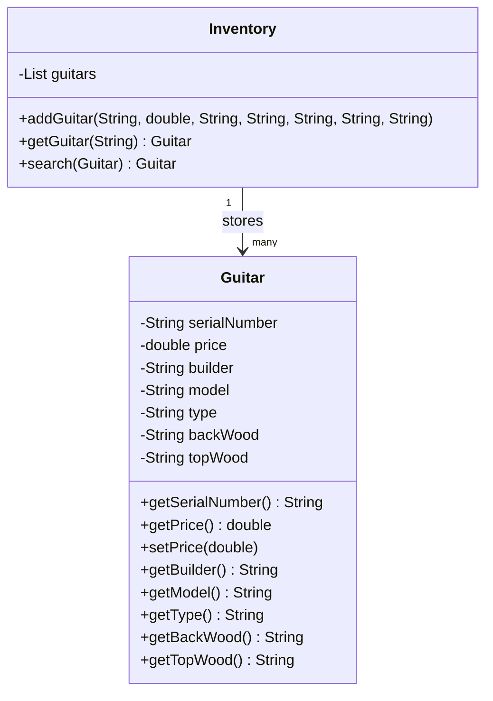
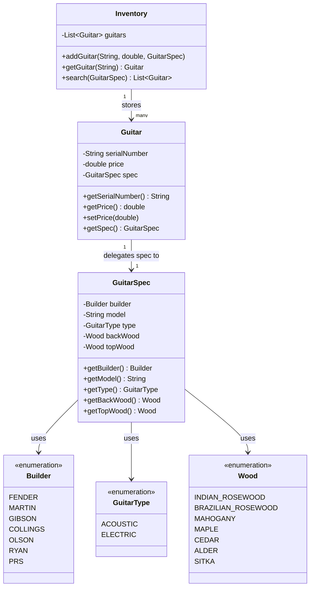

# 📖 Head First OOA&D — Chapter 1 Summary
## *Well-Designed Apps Rock*

> **Goal of this chapter:** Understand what "great software" really means, and learn a repeatable 3-step process to build it every single time.

---

## 🗺️ Chapter Overview

Chapter 1 kicks off with a real-world scenario: **Rick**, the owner of a high-end guitar shop, hired a firm to build him an inventory search tool. The app looked fine on paper — it had classes, methods, a UML diagram — but it was **broken**. Customers couldn't find guitars that Rick *knew* he had in stock.

The chapter walks you through diagnosing, fixing, and redesigning Rick's app using **Object-Oriented Analysis and Design (OOA&D)**. By the end, you'll have a clear mental framework for writing software that:

- Actually does what the customer wants
- Is flexible and easy to change
- Is well-designed and reusable

---

## 🎸 The Story: Rick's Guitar Shop

Rick runs a shop called **Rick's Guitars**. He replaced his paper-based system with a computer app built by a firm called *Down and Dirty Coding*. The app had two classes:

- **`Guitar`** — stores serial number, price, builder, model, type, and wood info
- **`Inventory`** — holds a list of guitars and provides a `search()` method

**The problem?** When customer Erin came in looking for a *Fender Stratocastor* guitar, the search returned nothing — even though Rick *had* the exact guitar she wanted in his inventory.

The bug was simple but revealing: the inventory stored `"fender"` (lowercase), but the search compared it to `"Fender"` (capitalized). A basic string-casing mismatch caused a real business failure.

> 💡 **The lesson:** It's not enough for code to *look* correct. It must **work** correctly for the customer.

---

## 🗂️ Class Diagrams: Before & After

### ❌ Before — The Original Broken Design

Everything crammed into two classes. `Guitar` holds both unique info **and** spec info. No separation of concerns. String-based properties everywhere — a recipe for bugs.



**Problems with this design:**
- `search()` takes a whole `Guitar` object just to compare specs — mismatched purpose
- `search()` returns only **one** result — what if there are multiple matches?
- All properties are raw `String` — case mismatch bugs guaranteed
- No separation between "what makes a guitar unique" vs "what a customer searches by"

---

### ✅ After — The Refactored, Well-Designed Version

Specs are extracted into `GuitarSpec`. Enums replace strings. `search()` returns a list. Responsibilities are clearly separated.



**What improved:**
- `Guitar` now holds a `GuitarSpec` reference — clean delegation
- `GuitarSpec` encapsulates all searchable properties in one place
- `search()` now takes a `GuitarSpec` (the right object for the job) and returns a `List<Guitar>`
- Enums (`Builder`, `GuitarType`, `Wood`) eliminate all string comparison bugs
- Adding new spec properties (e.g., `numStrings`) only requires changing `GuitarSpec`

---

## 🤔 What Does "Great Software" Actually Mean?

The chapter asks this directly, and presents three perspectives:

| Perspective | Definition |
|---|---|
| 🙋 Customer-focused | Software always does what the customer wants, even in unexpected situations |
| 🧑‍💻 OO-focused | No duplicate code; every object controls its own behavior; easy to extend |
| 🧘 Design-guru | Uses proven patterns; objects are loosely coupled; open for extension, closed for modification |

**The chapter's answer:** All three matter. Great software must satisfy the customer *and* be well designed.

---

## 🪜 The 3 Steps to Great Software (Every Time)

This is the core framework of the chapter — and arguably the whole book:

```
Step 1 → Make sure your software does what the customer wants it to do.
           ↓
Step 2 → Apply basic OO principles to add flexibility.
           ↓
Step 3 → Strive for a maintainable, reusable design.
```

### Step 1 — Make It Work

Your **first job** is always to satisfy the customer. Don't worry about patterns or architecture yet. Get the basic functionality right.

For Rick's app, this meant:
- Fixing the case-insensitive string comparison bug
- Replacing fragile `String` properties with **enumerated types** (`Builder`, `Type`, `Wood`) to prevent spelling errors and case issues
- Changing the `search()` method to return a **list** of matching guitars, not just one

### Step 2 — Apply OO Principles (Add Flexibility)

Once the app works, look for code smells:
- Duplicate code
- Objects doing too many things
- Poorly designed classes

For Rick's app, this meant noticing that the `Guitar` class held *both* unique guitar info (serial number, price) *and* spec info that clients use for searching (builder, type, wood). This led to **duplicate code** between `Guitar` and client search requests.

The fix: **Encapsulation** — extract the spec properties into a new `GuitarSpec` class.

### Step 3 — Strive for Reusability

Once the design is flexible, look at the big picture:
- Can you reuse parts of this app in other contexts?
- Are classes tightly coupled?
- Can you add a new feature (like 12-string guitars) without breaking everything?

For Rick's app, adding `numStrings` to `GuitarSpec` showed that `Guitar` and `Inventory` also had to change — a sign that the design still needed improvement via **delegation**.

---

## 🧩 Core Concepts Explained

### Encapsulation

**Encapsulation** means grouping related data and behavior together, and keeping it isolated from the rest of the app.

It has two flavors:
1. **Data protection** — making fields `private` so only the class controls them
2. **Logical grouping** — extracting a cluster of related properties into its own class

> 🎯 In Rick's app: Guitar spec properties (builder, type, wood) were pulled out of `Guitar` into a new `GuitarSpec` class. Now `Guitar` holds a *reference* to `GuitarSpec`, not the raw properties themselves.

**Rule of thumb:** Anytime you see **duplicate code**, look for a place to encapsulate.

---

### Delegation

**Delegation** means letting one object hand off responsibility to another object.

Instead of `Guitar` doing the spec comparison itself, it delegates that job to `GuitarSpec`. This makes each class responsible for only *its own* behavior — and makes the whole system easier to reuse.

> 🎯 In Rick's app: The `search()` method in `Inventory` gets `guitar.getSpec()` and then compares the specs. `Guitar` doesn't need to know the comparison logic.

---

### Fragile Code vs. Robust Code

**Fragile code** breaks easily when requirements change. Rick's original app was fragile because:
- String comparisons could fail due to case differences
- Adding a new guitar property required changes in multiple classes
- Classes were tightly coupled — you couldn't use one without the others

**Robust code** handles changes gracefully. After our refactoring:
- Enums prevent misspellings and casing errors
- `GuitarSpec` isolates guitar property logic in one place
- Adding `numStrings` only requires changing `GuitarSpec`

---

### OOA&D — Object-Oriented Analysis & Design

OOA&D is **not** about doing paperwork or drawing fancy diagrams. It's a practical approach to writing software that:

- ✅ Does what the customer wants
- ✅ Is flexible and easy to change
- ✅ Is maintainable and reusable
- ✅ Keeps customers *and* programmers happy

The four goals of OOA&D:
1. **Apps WORK** — satisfy the customer's requirements
2. **Apps KEEP WORKING** — robust code that doesn't break unexpectedly
3. **Apps can be UPGRADED** — using encapsulation, composition, and delegation
4. **Apps can be REUSED** — via OCP, SRP, and good analysis

---

## 🔍 Real-World Analogy

Think of a **guitar shop** as a software system:

- The **guitar itself** = your core data model (`Guitar` class)
- The **spec sheet** a customer hands you = the search request (`GuitarSpec`)
- The **inventory room** = your data store (`Inventory` class)
- **Finding the right guitar** = running the `search()` method

Just like a real guitar shop separates *what guitars it has* from *what a customer wants*, your software should separate **data models** from **search/filter criteria**. That's encapsulation in action.

---

## 💻 Dart Code Examples

### The Initial (Broken) Guitar Class

```dart
// ❌ Bad — uses raw strings for everything
// Case mismatch will cause search failures
class Guitar {
  final String serialNumber;
  double price;
  final String builder;  // "fender" vs "Fender" — problem!
  final String model;
  final String type;     // "electric" vs "Electric" — problem!
  final String backWood;
  final String topWood;

  Guitar(
    this.serialNumber,
    this.price,
    this.builder,
    this.model,
    this.type,
    this.backWood,
    this.topWood,
  );
}
```

---

### Step 1 Fix — Using Enums to Prevent String Errors

```dart
// ✅ Good — enums replace raw strings
// No more misspellings or case issues!

enum Builder { fender, martin, gibson, collings, olson, ryan, prs }

enum GuitarType { acoustic, electric }

enum Wood {
  indianRosewood,
  brazilianRosewood,
  mahogany,
  maple,
  cedar,
  alder,
  sitka,
}

class Guitar {
  final String serialNumber;
  double price;
  final Builder builder;  // Now type-safe!
  final String model;     // Model stays String (too many to enumerate)
  final GuitarType type;
  final Wood backWood;
  final Wood topWood;

  Guitar(
    this.serialNumber,
    this.price,
    this.builder,
    this.model,
    this.type,
    this.backWood,
    this.topWood,
  );
}
```

---

### Step 2 Fix — Encapsulation with GuitarSpec

```dart
// ✅ Better — extract spec properties into their own class
// Guitar holds unique info; GuitarSpec holds searchable properties

class GuitarSpec {
  final Builder builder;
  final String model;
  final GuitarType type;
  final Wood backWood;
  final Wood topWood;

  GuitarSpec({
    required this.builder,
    required this.model,
    required this.type,
    required this.backWood,
    required this.topWood,
  });
}

class Guitar {
  final String serialNumber;
  double price;
  final GuitarSpec spec; // Guitar now delegates spec responsibilities

  Guitar(this.serialNumber, this.price, this.spec);

  GuitarSpec getSpec() => spec;
}
```

---

### The Inventory Search — Returning Multiple Matches

```dart
class Inventory {
  final List<Guitar> _guitars = [];

  void addGuitar(String serialNumber, double price, GuitarSpec spec) {
    _guitars.add(Guitar(serialNumber, price, spec));
  }

  Guitar? getGuitar(String serialNumber) {
    return _guitars.firstWhere(
      (g) => g.serialNumber == serialNumber,
      orElse: () => throw Exception('Not found'),
    );
  }

  // Step 1 fix: return a LIST of matches, not just one
  List<Guitar> search(GuitarSpec searchSpec) {
    final matches = <Guitar>[];

    for (final guitar in _guitars) {
      final guitarSpec = guitar.getSpec();

      // Skip if builder doesn't match
      if (searchSpec.builder != guitarSpec.builder) continue;

      // Model comparison is case-insensitive (still a String)
      if (searchSpec.model.isNotEmpty &&
          searchSpec.model.toLowerCase() !=
              guitarSpec.model.toLowerCase()) continue;

      if (searchSpec.type != guitarSpec.type) continue;
      if (searchSpec.backWood != guitarSpec.backWood) continue;
      if (searchSpec.topWood != guitarSpec.topWood) continue;

      matches.add(guitar); // It's a match!
    }

    return matches;
  }
}
```

---

### Using the App (Final Version)

```dart
void main() {
  final inventory = Inventory();

  // Add guitars to Rick's inventory
  inventory.addGuitar(
    'V95693',
    1499.95,
    GuitarSpec(
      builder: Builder.fender,
      model: 'Stratocastor',
      type: GuitarType.electric,
      backWood: Wood.alder,
      topWood: Wood.alder,
    ),
  );

  inventory.addGuitar(
    'V9512',
    1549.95,
    GuitarSpec(
      builder: Builder.fender,
      model: 'Stratocastor',
      type: GuitarType.electric,
      backWood: Wood.alder,
      topWood: Wood.alder,
    ),
  );

  // Customer search request — no strings, no case issues!
  final erin = GuitarSpec(
    builder: Builder.fender,
    model: 'Stratocastor',
    type: GuitarType.electric,
    backWood: Wood.alder,
    topWood: Wood.alder,
  );

  final results = inventory.search(erin);

  if (results.isEmpty) {
    print('Sorry, we have nothing for you.');
  } else {
    print('Erin, you might like these guitars:');
    for (final guitar in results) {
      final spec = guitar.getSpec();
      print(
        'We have a ${spec.builder.name} ${spec.model} '
        '${spec.type.name} guitar:\n'
        '  ${spec.backWood.name} back and sides\n'
        '  ${spec.topWood.name} top\n'
        '  Only \$${guitar.price}!\n'
        '----',
      );
    }
  }
}
```

---

## ✅ Key Takeaways

- **Start with the customer.** Before thinking about design, make sure the software actually works the way the customer expects.
- **Enums beat strings.** When a property has a fixed set of values, use an enum. It prevents typos, case errors, and invalid data.
- **Encapsulation is more than `private`.** It's also about grouping related things together and isolating parts that change from parts that don't.
- **Duplicate code is a design smell.** Whenever you see the same logic in multiple places, look for a way to encapsulate it.
- **Delegation reduces coupling.** Instead of one class doing everything, let objects hand off responsibilities to specialists.
- **Don't over-engineer early.** Get the functionality working first, then improve the design.
- **Fragile code is expensive.** Apps that break when requirements change cost real time, money, and customer trust.
- **OOA&D is a mindset, not paperwork.** It's about writing software that's functional, flexible, and reusable — not drawing diagrams for their own sake.

---

## ⚠️ Common Mistakes & Misunderstandings

### ❌ Mistake 1: Jumping straight to design patterns
Many beginners (and even experienced developers) try to apply design patterns before the app even works correctly. The book is clear: **functionality first, design second**.

### ❌ Mistake 2: Treating encapsulation as just "make fields private"
Encapsulation is *also* about separating things that change from things that don't — like extracting `GuitarSpec` from `Guitar`.

### ❌ Mistake 3: Using strings for everything
Strings are flexible but dangerous. If a value has a fixed set of options (like guitar builders or wood types), use an **enum**. It gives you type safety and value safety at once.

### ❌ Mistake 4: Returning only one result when multiple make sense
Rick's original `search()` returned one `Guitar`. But Rick might have two matching guitars! Always think about what the *customer* actually needs, not just what's easy to code.

### ❌ Mistake 5: Thinking great software = complex software
The best code is often the simplest code that satisfies the customer. Don't add complexity for its own sake.

### ❌ Mistake 6: Creating new problems to solve old ones
When fixing a bug, be careful not to introduce design debt. The chapter's mantra: **"Don't create problems to solve problems."**

---

## ❓ There's No Dumb Questions

**Q: Do I have to follow the 3 steps in exact order every time?**

A: Not necessarily. The steps are guidelines, not a strict ritual. But they do provide a safe order that prevents common pitfalls — like spending days on a beautiful architecture for software that doesn't do what the customer asked for. In practice, you'll often move back and forth between the steps.

---

**Q: Why use enums instead of just calling `.toLowerCase()` on everything?**

A: You *could* use `toLowerCase()` to fix the casing bug, but that's a band-aid. It doesn't prevent *misspellings* (`"fendder"`), and it doesn't restrict input to valid values. An enum guarantees the value is *always* valid — the compiler won't even let you type an invalid one.

---

**Q: Is `GuitarSpec` just a data class? What's the point of a separate class for that?**

A: Yes, `GuitarSpec` is essentially a value object. The point is *isolation*. If Rick ever wants to add a new spec property (like `numStrings` for 12-string guitars), you only touch `GuitarSpec` — not `Guitar`, not `Inventory`. Without `GuitarSpec`, a simple addition would ripple across multiple classes.

---

**Q: What's the difference between encapsulation and delegation?**

A: Encapsulation groups related things together and hides them behind an interface. Delegation means object A asks object B to handle a responsibility that B is better suited for. They work together: you often encapsulate something into a new class (like `GuitarSpec`), and then *delegate* to that class from others (like `Guitar` delegating spec queries to `GuitarSpec`).

---

**Q: The chapter talks about "fragile" code. How do I know if my code is fragile?**

A: A quick test: try making a small change (add a new property, change a requirement) and count how many files you have to touch. If the answer is more than one or two, your code is probably more fragile than it should be. Good design means changes ripple as little as possible.

---

**Q: Is OOA&D only useful for large apps? My Flutter projects are small.**

A: OOA&D scales down beautifully. Even small apps benefit from good class design. In Flutter terms: keeping your data models, domain logic, and UI concerns separate is OOA&D in action. Clean architecture in Flutter *is* OOA&D.

---

**Q: What's wrong with having one big class that does everything?**

A: It violates the **Single Responsibility Principle**: every class should have one reason to change. A class that does too many things is hard to test, hard to reuse, and becomes a maintenance nightmare when requirements change — which they always do.

---

**Q: In the book the search method receives a `Guitar` object to search with. Isn't that weird?**

A: Yes! That's actually one of the design problems the chapter uncovers. Passing a full `Guitar` object (with a serial number, price, etc.) to `search()` when the client only cares about the *specs* is a mismatched object type. That's why `GuitarSpec` was introduced — it's the *right* object type for a search request, because it only contains what a customer would actually specify.

---

## 📚 Key Terminology

| Term | Definition |
|---|---|
| **OOA&D** | Object-Oriented Analysis & Design — an approach to building software that satisfies customers and is well-structured and reusable |
| **Encapsulation** | Grouping related data/behavior together and isolating it from the rest of the app. Also: separating what changes from what doesn't |
| **Delegation** | When one object hands off a responsibility to another object better suited to handle it |
| **Fragile code** | Code that breaks easily when requirements change, due to tight coupling or duplicated logic |
| **Robust code** | Code that handles change gracefully; also called "resilient" code |
| **Enumerated type (Enum)** | A type that restricts a variable to one of a fixed set of named constants — great for replacing magic strings |
| **UML Class Diagram** | A visual diagram showing classes, their properties, methods, and relationships |
| **Duplicate code** | The same or very similar logic appearing in multiple places — a major code smell that often signals a need for encapsulation |
| **Type safety** | A compile-time guarantee that a variable holds a valid value of its declared type |
| **Value safety** | A guarantee that a variable can only hold a valid *value* — not just any value of the right type (enums provide this) |
| **Coupling** | How dependent classes are on each other. Tightly coupled classes are hard to change or reuse independently |
| **Single Responsibility Principle (SRP)** | A class should have only one reason to change — it should do one thing well |
| **Open-Closed Principle (OCP)** | Code should be open for extension but closed for modification — add new features without rewriting existing code |

---

## 🏁 Chapter Summary

Chapter 1 establishes the **foundation for the entire book**. The central message is simple but powerful:

> Writing great software isn't random. It's a repeatable process. Start with what the customer needs. Then make your design flexible. Then make it maintainable.

By the end of the chapter, Rick's broken search tool was transformed into a well-designed, flexible system that:
- Returns all matching guitars (not just one)
- Uses enums to eliminate string comparison bugs
- Uses `GuitarSpec` to encapsulate changeable spec properties
- Can accommodate new features (like 12-string guitars) with minimal code changes

That's OOA&D. That's great software. 🎸
