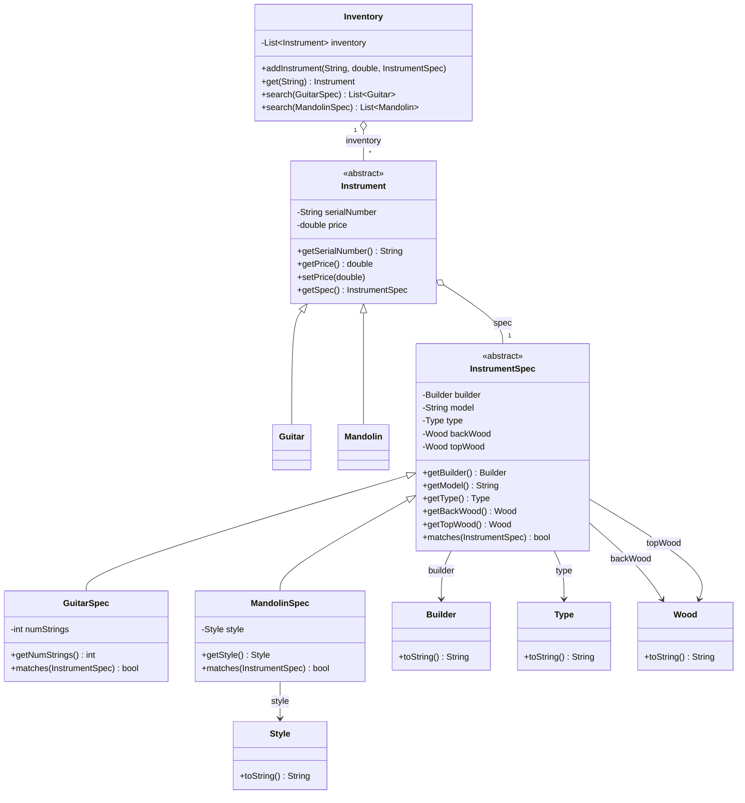

# 📖 Head First OOA&D — Chapter 5 (Part 1) Summary
## *Good Design = Flexible Software: Nothing Ever Stays the Same*

> **Goal of this chapter:** Take Rick's guitar search tool (from Chapter 1) and test how flexible it really is when the customer asks for new features. Discover that good design isn't built once — it evolves. Learn the three most important OO Principles, and understand **Abstract Classes**, **Inheritance**, **Aggregation**, and **Generalization** in UML.

---

## 🗺️ Chapter Overview

### What is this chapter about?

Part 1 has two connected acts:

**Act 1 (pp. 197–219):** Rick's business is booming, and now he wants to sell **mandolins** in addition to guitars. We test the existing design by trying to add mandolins — and discover where it starts to crack. Abstract classes and inheritance to the rescue... but new problems emerge.

**Act 2 (pp. 220–232) — OO Catastrophe! :** Before we fix Rick's code, we pause for a game show that teaches three critical OO Design Principles — **Interface, Encapsulation,** and **Single Responsibility** — through memorable examples: Athlete teams, Painters, and Automobiles.

---

## 🎸 The Story: Rick's Guitars → Rick's Instruments

Rick has been selling guitars left and right using the search tool built in Chapter 1. Business is so good, he wants to expand:

> *"I want to start carrying mandolins, too. They're a lot like guitars — shouldn't be too hard to support, right?"*

**The challenge:** Add mandolin support without breaking the existing guitar search, and without duplicating code.

> 💡 **The real test of good design:** Can you change your software easily? If adding a new instrument type takes 30 minutes — great design. If it takes 3 days — bad design. Let's find out which one Rick's app is.

---

## 🔁 Step 1 — The First Attempt: Naive Approach

The instinctive move: add a `Mandolin` class and a `MandolinSpec` class alongside the existing `Guitar` and `GuitarSpec`.

**The MandolinSpec vs GuitarSpec — they're almost identical:**

| Property | GuitarSpec | MandolinSpec |
|---|---|---|
| builder | ✅ | ✅ |
| model | ✅ | ✅ |
| type | ✅ | ✅ |
| backWood | ✅ | ✅ |
| topWood | ✅ | ✅ |
| numStrings | ✅ | ❌ (mandolins always have 8) |
| **style** | ❌ | ✅ (A-style or F-style) |

Nearly everything is shared — just one property differs in each direction. This is a classic sign that **inheritance** is the right tool.

---

## 🧬 Abstract Classes — The Key Insight

### What is an Abstract Class?

An **abstract class** is a placeholder — it defines what all instruments (or all instrument specs) have in common, but you can never instantiate it directly.

```
╔══════════════════════════════════════════════════════╗
║  Abstract Class = Defines behavior, cannot be        ║
║                   instantiated.                      ║
║  Subclasses = Implement that behavior, can be        ║
║               instantiated.                          ║
╚══════════════════════════════════════════════════════╝
```

**In Dart:**
```dart
// Abstract class — no one creates an "Instrument" directly
// It's a placeholder for Guitar, Mandolin, Banjo, etc.
abstract class Instrument {
  final String serialNumber;
  double price;
  final InstrumentSpec spec;

  Instrument(this.serialNumber, this.price, this.spec);

  String getSerialNumber() => serialNumber;
  double getPrice() => price;
  void setPrice(double price) => this.price = price;
  InstrumentSpec getSpec() => spec;
}
```

```dart
// Concrete subclass — CAN be instantiated
class Guitar extends Instrument {
  Guitar(String serialNumber, double price, GuitarSpec spec)
      : super(serialNumber, price, spec);
}

class Mandolin extends Instrument {
  Mandolin(String serialNumber, double price, MandolinSpec spec)
      : super(serialNumber, price, spec);
}
```

Notice: `Guitar` and `Mandolin` only have constructors — all the real behavior lives in `Instrument`.

---

## 🧬 Abstract InstrumentSpec — Second Level of Abstraction

Since `GuitarSpec` and `MandolinSpec` share so many properties, we create a second abstract base class:

```dart
abstract class InstrumentSpec {
  final Builder builder;
  final String? model;
  final Type type;
  final Wood backWood;
  final Wood topWood;

  InstrumentSpec(this.builder, this.model, this.type,
                 this.backWood, this.topWood);

  Builder getBuilder() => builder;
  String? getModel() => model;
  Type getType() => type;
  Wood getBackWood() => backWood;
  Wood getTopWood() => topWood;

  // Subclasses override this to add instrument-specific comparisons
  bool matches(InstrumentSpec otherSpec) {
    if (builder != otherSpec.builder) return false;
    if (model != null && model!.isNotEmpty &&
        model!.toLowerCase() != otherSpec.model?.toLowerCase()) return false;
    if (type != otherSpec.type) return false;
    if (backWood != otherSpec.backWood) return false;
    if (topWood != otherSpec.topWood) return false;
    return true;
  }
}
```

```dart
// GuitarSpec only adds what's guitar-specific: numStrings
class GuitarSpec extends InstrumentSpec {
  final int numStrings;

  GuitarSpec(Builder builder, String? model, Type type,
             Wood backWood, Wood topWood, this.numStrings)
      : super(builder, model, type, backWood, topWood);

  int getNumStrings() => numStrings;

  @override
  bool matches(InstrumentSpec otherSpec) {
    if (!super.matches(otherSpec)) return false;
    if (otherSpec is! GuitarSpec) return false;
    return numStrings == otherSpec.numStrings;
  }
}

// MandolinSpec only adds what's mandolin-specific: style
class MandolinSpec extends InstrumentSpec {
  final Style style;

  MandolinSpec(Builder builder, String? model, Type type,
               Wood backWood, Wood topWood, this.style)
      : super(builder, model, type, backWood, topWood);

  Style getStyle() => style;

  @override
  bool matches(InstrumentSpec otherSpec) {
    if (!super.matches(otherSpec)) return false;
    if (otherSpec is! MandolinSpec) return false;
    return style == otherSpec.style;
  }
}
```

---

## 🗂️ UML Cheat Sheet — New Notation in Chapter 5

The chapter introduces three new UML relationship types:

| What we call it | UML name | How it looks in UML |
|---|---|---|
| Abstract Class | Abstract Class | *Italicized class name* |
| Relationship / reference | Association | `────────►` solid line with arrow |
| Inheritance / "extends" | Generalization | `──────────▷` hollow arrowhead |
| "Is made up of" | Aggregation | `◇──────────` diamond at source end |

### Aggregation vs Association

**Association:** One class *has a reference to* another class.
```
Instrument ────► InstrumentSpec    (Instrument HAS-A spec)
```

**Aggregation:** One class is *made up in part of* another class.
```
Instrument ◇──► InstrumentSpec    (Instrument is COMPOSED OF a spec)
```
Aggregation implies the whole is partly made up of its parts — the diamond goes on the "whole" side.

**Generalization (Inheritance):**
```
Guitar ──────▷ Instrument    (Guitar IS-A Instrument)
Mandolin ────▷ Instrument    (Mandolin IS-A Instrument)
```

---

## 🗂️ Class Diagram — Rick's App v2 (with Mandolin Support)



---

## 🧪 3 Steps to Great Software — How Does Rick's App Score?

The book revisits the 3-step checklist from Chapter 1:

| Step | Question | Answer for Rick's v2 |
|---|---|---|
| 1 | Does it do what the customer wants? | ✅ Mostly — finds guitars AND mandolins |
| 2 | Uses solid OO principles? | ✅ Yes — encapsulation, inheritance |
| 3 | Easy to reuse and extend? | ❌ **No** — still lots of work to add new types |

**The problem discovered:** When Rick says he also wants bass guitars, dobros, banjos, and fiddles — the design starts to fall apart:

- Every new instrument type needs a new `Instrument` subclass (e.g., `Banjo`, `Dobro`)
- Every new instrument type needs a new `InstrumentSpec` subclass (e.g., `BanjoSpec`)
- The `Inventory` class needs a new `search()` method for each type
- The `addInstrument()` method grows longer with every new `instanceof` check

This is **not** a flexible design. And that leads us to the next section.

---

## 🎮 OO Catastrophe! — The Game Show

Before fixing Rick's code, the chapter pauses to teach three critical OO principles through a Jeopardy-style game show. The host gives answers; you figure out the principle.

---

### 🏆 Principle 1: Code to an Interface, Not an Implementation

**Answer:** *"This code construct has the dual role of defining behavior that applies to multiple types, and also being the preferred focus of classes that use those types."*

**Question:** What is an **Interface**?

**The Athlete Example:**

```
// ❌ Coding to an IMPLEMENTATION — tight coupling
class Team {
  void addPlayer(BaseballPlayer player) { ... }
  // This only works with BaseballPlayer!
  // Add a hockey player? You need a new method.
}

// ✅ Coding to an INTERFACE — flexible
abstract class Athlete {
  String getSport();
  void play();
}

class Team {
  void addPlayer(Athlete player) { ... }
  // Works with ANY Athlete: Baseball, Hockey, Tennis, Cricket...
  // Even ones that don't exist yet!
}
```

> **Key insight:** When you code to an interface (or abstract class), your code works with **all** of the interface's subclasses — even ones that haven't been written yet.

**In Dart / Flutter terms:**
```dart
// ❌ Tight coupling — depends on specific implementation
class OrderScreen extends StatefulWidget {
  final FirebaseRepository repo; // only Firebase!
}

// ✅ Code to interface — loose coupling
abstract class OrderRepository {
  Future<List<Order>> getOrders();
  Future<void> saveOrder(Order order);
}

class OrderScreen extends StatefulWidget {
  final OrderRepository repo; // works with Firebase, SQLite, mock, anything!
}
```

---

### 🏆 Principle 2: Encapsulate What Varies

**Answer:** *"It's been responsible for preventing more maintenance problems than any other OO principle in history, by localizing the changes required for the behavior of an object to vary."*

**Question:** What is **Encapsulation**?

**The Painter Example:**

```
// ❌ paint() varies wildly — keeps changing inside Painter
class Painter {
  void prepareEasel() { ... }  // stable
  void cleanBrushes() { ... }  // stable
  void paint() { ... }         // varies — style changes constantly!
}

// ✅ Extract what varies into its own class
abstract class PaintStyle {
  String getStyle();
  void paint();
}

class ModernPaintStyle implements PaintStyle { ... }
class ImpressionistPaintStyle implements PaintStyle { ... }
class SurrealPaintStyle implements PaintStyle { ... }

class Painter {
  PaintStyle _style;
  Painter(this._style);

  void prepareEasel() { ... }
  void cleanBrushes() { ... }
  void paint() => _style.paint(); // delegates to the varying style
  void setPaintStyle(PaintStyle style) => _style = style;
}
```

Now when the painting style changes, only the `PaintStyle` implementation changes. `Painter` stays the same.

---

### 🏆 Principle 3: Each Class Should Have Only ONE Reason to Change (SRP)

**Answer:** *"Every class should attempt to make sure that it has only one reason to this, the death of many a badly designed piece of software."*

**Question:** What is **Change** / **Single Responsibility Principle**?

**The Automobile Example:**

```
// ❌ Automobile has MANY reasons to change
class Automobile {
  void start() { ... }
  void stop() { ... }
  void changeTires(List<Tire> tires) { ... }  // Mechanic logic
  void drive() { ... }                         // Driver logic
  void wash(Automobile car) { ... }            // CarWash logic
  void checkOil() { ... }                      // Mechanic logic
  int getOil() { ... }
}
// If how tires are changed changes → Automobile changes
// If how a car is driven changes → Automobile changes
// If how washing works changes → Automobile changes
// THREE different reasons to change = bad design
```

```dart
// ✅ Each class has ONE reason to change
class Automobile {
  void start() { }
  void stop() { }
  int getOil() => 0;
}

class Driver {
  void drive(Automobile car) { }
}

class CarWash {
  void wash(Automobile car) { }
}

class Mechanic {
  void checkOil(Automobile car) { }
  void changeTires(Automobile car, List<Tire> tires) { }
}
// Now each class changes for exactly ONE reason
```

---

## 🍦 Final Catastrophe — The Ice Cream Problem

The chapter ends OO Catastrophe with a full design problem to solve using all three principles. The bad design has a `DessertCounter` with methods for both `Cone` and `Sundae`, a `Syrup` subclassing `Topping`, and many `serve()` methods scattered everywhere.

**The fixes, applying all three principles:**

1. **DessertCounter has more than one reason to change** (ordering changes + topping changes) → SRP violation. Should code to the `Dessert` interface, not `Cone`/`Sundae` implementations.

2. **`Syrup` is an implementation of `Topping`** — `DessertCounter` shouldn't have an `addSyrup()` method specifically. Code to the `Topping` interface.

3. **`serve()` is duplicated** across `Dessert`, `IceCream`, `Topping`, and all subclasses → Encapsulate what varies. Pull `serve()` into a `DessertService` class.

---

## 📋 The 3 OO Principles — Summary Card

```
╔══════════════════════════════════════════════════════════════╗
║                    OO PRINCIPLES                             ║
╠══════════════════════════════════════════════════════════════╣
║                                                              ║
║  1. Encapsulate what varies.                                 ║
║     Find the parts likely to change — isolate them.         ║
║                                                              ║
║  2. Code to an interface, not an implementation.             ║
║     Program to abstract types / base classes, not           ║
║     concrete subclasses. Gain flexibility for free.         ║
║                                                              ║
║  3. Each class should have only ONE reason to change.        ║
║     If a class has multiple responsibilities, split it.     ║
║     High cohesion = one job, done really well.              ║
║                                                              ║
╚══════════════════════════════════════════════════════════════╝
```

---

## 💻 Complete Dart Code — Rick's App v2 (Part 1 Final State)

```dart
// ═══════════════════════════════════
// ENUMS
// ═══════════════════════════════════
enum Builder { collings, martin, gibson, fender, epiphoneone }
enum Type { acoustic, electric }
enum Wood { indianRosewood, brazilianRosewood, mahogany, maple,
            sitka, alder, adirondack, afrikaan, cherry }
enum Style { a, f } // Mandolin styles

// ═══════════════════════════════════
// ABSTRACT BASE: InstrumentSpec
// ═══════════════════════════════════
abstract class InstrumentSpec {
  final Builder builder;
  final String? model;
  final Type type;
  final Wood backWood;
  final Wood topWood;

  const InstrumentSpec(this.builder, this.model, this.type,
                       this.backWood, this.topWood);

  Builder getBuilder() => builder;
  String? getModel() => model;
  Type getType() => type;
  Wood getBackWood() => backWood;
  Wood getTopWood() => topWood;

  bool matches(InstrumentSpec other) {
    if (builder != other.builder) return false;
    if (model != null && model!.isNotEmpty &&
        model!.toLowerCase() != other.model?.toLowerCase()) return false;
    if (type != other.type) return false;
    if (backWood != other.backWood) return false;
    if (topWood != other.topWood) return false;
    return true;
  }
}

// ═══════════════════════════════════
// GuitarSpec
// ═══════════════════════════════════
class GuitarSpec extends InstrumentSpec {
  final int numStrings;

  const GuitarSpec(Builder builder, String? model, Type type,
                   Wood backWood, Wood topWood, this.numStrings)
      : super(builder, model, type, backWood, topWood);

  int getNumStrings() => numStrings;

  @override
  bool matches(InstrumentSpec other) {
    if (!super.matches(other)) return false;
    if (other is! GuitarSpec) return false;
    return numStrings == other.numStrings;
  }
}

// ═══════════════════════════════════
// MandolinSpec
// ═══════════════════════════════════
class MandolinSpec extends InstrumentSpec {
  final Style style;

  const MandolinSpec(Builder builder, String? model, Type type,
                     Wood backWood, Wood topWood, this.style)
      : super(builder, model, type, backWood, topWood);

  Style getStyle() => style;

  @override
  bool matches(InstrumentSpec other) {
    if (!super.matches(other)) return false;
    if (other is! MandolinSpec) return false;
    return style == other.style;
  }
}

// ═══════════════════════════════════
// ABSTRACT BASE: Instrument
// ═══════════════════════════════════
abstract class Instrument {
  final String serialNumber;
  double price;
  final InstrumentSpec spec;

  Instrument(this.serialNumber, this.price, this.spec);

  String getSerialNumber() => serialNumber;
  double getPrice() => price;
  void setPrice(double p) => price = p;
  InstrumentSpec getSpec() => spec;

  @override
  String toString() =>
      '${spec.runtimeType.toString().replaceAll("Spec", "")} '
      '[#$serialNumber] \$${price.toStringAsFixed(2)}';
}

// ═══════════════════════════════════
// Guitar and Mandolin subclasses
// ═══════════════════════════════════
class Guitar extends Instrument {
  Guitar(String serialNumber, double price, GuitarSpec spec)
      : super(serialNumber, price, spec);
}

class Mandolin extends Instrument {
  Mandolin(String serialNumber, double price, MandolinSpec spec)
      : super(serialNumber, price, spec);
}

// ═══════════════════════════════════
// INVENTORY
// Problem: needs separate search() for each instrument type
// This is what Part 2 will fix
// ═══════════════════════════════════
class Inventory {
  final List<Instrument> _inventory = [];

  void addInstrument(String serialNumber, double price,
                     InstrumentSpec spec) {
    Instrument instrument;
    if (spec is GuitarSpec) {
      instrument = Guitar(serialNumber, price, spec);
    } else if (spec is MandolinSpec) {
      instrument = Mandolin(serialNumber, price, spec);
    } else {
      throw ArgumentError('Unknown InstrumentSpec type');
    }
    _inventory.add(instrument);
  }

  Instrument? get(String serialNumber) {
    return _inventory
        .where((i) => i.getSerialNumber() == serialNumber)
        .firstOrNull;
  }

  // Separate search per instrument type — the problem we'll fix in Part 2
  List<Guitar> searchGuitars(GuitarSpec searchSpec) {
    return _inventory
        .whereType<Guitar>()
        .where((g) => g.getSpec().matches(searchSpec))
        .toList();
  }

  List<Mandolin> searchMandolins(MandolinSpec searchSpec) {
    return _inventory
        .whereType<Mandolin>()
        .where((m) => m.getSpec().matches(searchSpec))
        .toList();
  }
}

// ═══════════════════════════════════
// MAIN — Test Drive
// ═══════════════════════════════════
void main() {
  final inventory = Inventory();

  // Add some guitars
  inventory.addInstrument('11277', 3999.95,
      GuitarSpec(Builder.collings, 'CJ', Type.acoustic,
                 Wood.indianRosewood, Wood.sitka, 6));

  inventory.addInstrument('V95693', 1499.95,
      GuitarSpec(Builder.fender, 'Stratocastor', Type.electric,
                 Wood.alder, Wood.alder, 6));

  // Add some mandolins
  inventory.addInstrument('9019920', 5495.99,
      MandolinSpec(Builder.gibson, 'F-5G', Type.acoustic,
                   Wood.maple, Wood.maple, Style.f));

  // Search for guitars
  print('=== Searching for Gibson electric guitars ===');
  final guitarSearch = GuitarSpec(
      Builder.gibson, null, Type.electric,
      Wood.maple, Wood.maple, 6);
  final guitars = inventory.searchGuitars(guitarSearch);
  if (guitars.isEmpty) {
    print('No matching guitars found.');
  } else {
    for (final g in guitars) print('  Found: $g');
  }

  // Search for mandolins
  print('\n=== Searching for acoustic mandolins ===');
  final mandolinSearch = MandolinSpec(
      Builder.gibson, null, Type.acoustic,
      Wood.maple, Wood.maple, Style.f);
  final mandolins = inventory.searchMandolins(mandolinSearch);
  if (mandolins.isEmpty) {
    print('No matching mandolins found.');
  } else {
    for (final m in mandolins) print('  Found: $m');
  }
}
```

---

## ✅ Key Takeaways

- **Change is the true test of design.** If adding mandolins is easy, your design is good. If it triggers cascading changes everywhere, your design has problems.
- **Abstract classes are placeholders.** They define common behavior that subclasses implement. You can never instantiate them directly — and that's the point.
- **The abstract class defines the contract; the subclasses fulfill it.** `Instrument` says every instrument has a serial number and a price. `Guitar` and `Mandolin` say nothing new — they just inherit it.
- **Whenever you find common behavior in two or more places, abstract it.** This is what led to both `Instrument` and `InstrumentSpec` abstract base classes.
- **Code to an interface, not an implementation.** Write methods that take the base class/interface type, and they'll work with any subclass — even future ones.
- **Encapsulate what varies.** Move the parts that change into separate classes. The stable parts stay put; the variable parts can evolve independently.
- **Each class should have only ONE reason to change.** If a class does too many things, split it. The more focused a class is, the easier it is to change without breaking other things.
- **Good design is iterative.** Even the abstract class design we ended up with in Part 1 still has problems. Part 2 fixes them. Most good designs come from analyzing bad designs first.

---

## ⚠️ Problems NOT Yet Fixed (Leads into Part 2)

By the end of Part 1, Rick's app still has these issues:

1. **`addInstrument()` has instrument-specific `instanceof` checks** — grows with every new instrument type (Banjo, Dobro, Bass, Fiddle...)
2. **Separate `search()` method per instrument type** — `searchGuitars()`, `searchMandolins()`, `searchBanjos()`...
3. **Empty subclasses** — `Guitar` and `Mandolin` only have constructors. Is there really a need for separate subclasses just for that?
4. **`InstrumentSpec` subclasses add only one property each** — is all this inheritance really necessary, or is there a simpler way?

These problems are exactly what Chapter 5 **Part 2** solves. 🚀

---

## 📚 Key Terminology

| Term | Definition |
|---|---|
| **Abstract Class** | A class marked `abstract` that cannot be instantiated directly; defines behavior that subclasses must implement |
| **Concrete Class** | A non-abstract class that can be instantiated; provides actual implementations of all methods |
| **Subclass** | A class that `extends` another class, inheriting its attributes and methods |
| **Superclass** | The parent class that is extended by subclasses |
| **Inheritance** | The mechanism by which a subclass acquires all attributes and behavior of its superclass |
| **Generalization** | UML term for inheritance; shown with a hollow arrowhead (▷) |
| **Aggregation** | A UML relationship showing that one class is "made up of" another; shown with a diamond (◇) |
| **Association** | A general UML relationship showing one class has a reference to another; shown with a solid arrow (►) |
| **Interface** | In OO design, a type that defines behavior without implementing it; code to this, not to implementations |
| **Code to an interface** | Write code that uses the abstract type/interface, not a specific subclass — gaining flexibility |
| **Encapsulate what varies** | The OO principle of isolating behavior that changes into its own class, away from stable behavior |
| **Single Responsibility Principle (SRP)** | Each class should have only one reason to change — one focused job |
| **Cohesion** | How closely related all the responsibilities of a class are; high cohesion = one focused job |