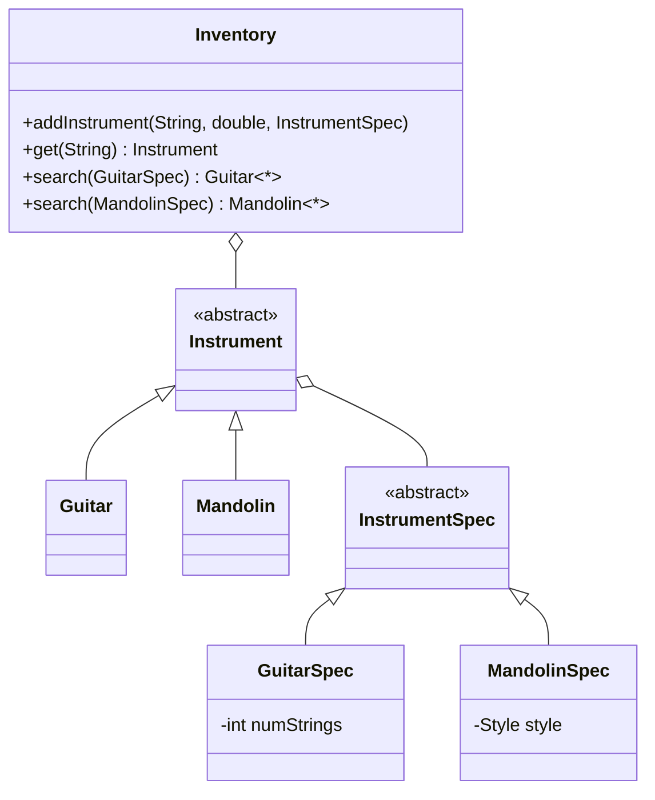
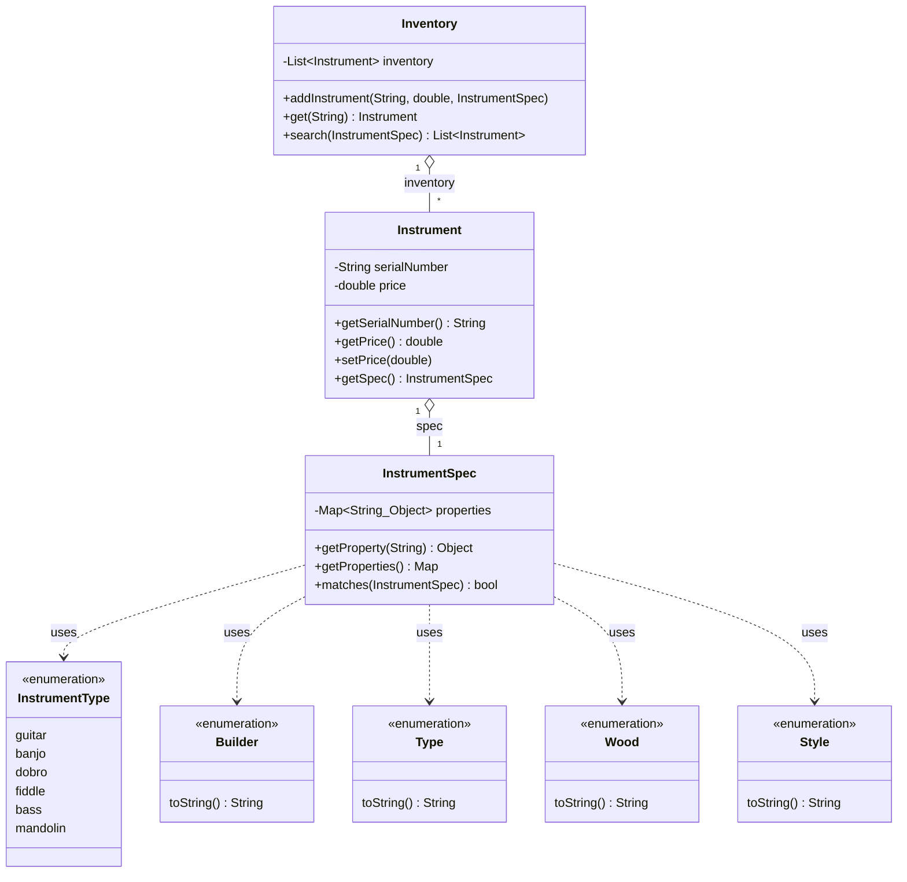

# 📖 Head First OOA&D — Chapter 5 (Part 2) Summary
## *Good Design = Flexible Software: Give Your Software a 30-Minute Workout*

> **Goal of this chapter:** Take the still-inflexible Rick's Instruments app from Part 1 and fix it completely. Kill the empty instrument subclasses. Make `InstrumentSpec` concrete using a `Map` for dynamic properties. Achieve a design so flexible that adding a new instrument type requires **zero new classes**. Understand **cohesion** and **loose coupling** — the hallmarks of truly great software.

---

## 🗺️ Chapter Overview

Part 2 is a workout. We take everything we learned in OO Catastrophe (the three OO principles) and ruthlessly apply them to Rick's app — even if it means throwing away design decisions we made earlier.

**The chapter has three phases:**

1. **Identify the remaining problems** in the Part 1 design
2. **Apply OO principles** to kill those problems one by one
3. **Validate the result** with the Ease-of-Change Challenge and understand **cohesion**

---

## 🩺 Back to Rick's App — The Remaining Problems

After Part 1, Rick's app looks like this:



**Problem 1 — `addInstrument()` has instrument-specific `instanceof` code:**

```dart
// Every new instrument type makes this longer and more fragile
void addInstrument(String serial, double price, InstrumentSpec spec) {
  if (spec is GuitarSpec) {
    inventory.add(Guitar(serial, price, spec as GuitarSpec));
  } else if (spec is MandolinSpec) {
    inventory.add(Mandolin(serial, price, spec as MandolinSpec));
  }
  // Add Banjo → add another else-if here
  // Add Dobro → add another else-if here
  // Never ends...
}
```

**Problem 2 — Separate `search()` method per instrument type:**
```dart
List<Guitar> search(GuitarSpec spec) { ... }
List<Mandolin> search(MandolinSpec spec) { ... }
List<Banjo> search(BanjoSpec spec) { ... }  // would need this too
// n instrument types = n search() methods
```

**Problem 3 — Empty subclasses that add nothing:**
```dart
// Guitar and Mandolin only have constructors
// They have no different behavior from Instrument
// So why do they exist?
class Guitar extends Instrument {
  Guitar(String sn, double price, GuitarSpec spec) : super(sn, price, spec);
}
```

**The root question:** Do we really need subclasses for each instrument type if they all behave the same? The answer from OO Catastrophe: **subclasses are for different behavior, not different properties.**

---

## 🔪 Fix 1: Kill the Instrument-Specific Subclasses

> **"Classes are about behavior. If the subclasses don't behave differently, you don't need them."**

In Rick's app, all instruments behave the same. A guitar doesn't `strum()`, a mandolin doesn't `pluck()` — those aren't in the design. The only difference is their **properties** (stored in their spec). Since properties are already handled by `InstrumentSpec` and its subclasses, the `Guitar` and `Mandolin` subclasses of `Instrument` serve no purpose.

**Solution:**
- Make `Instrument` a **concrete** (non-abstract) class
- Add an `InstrumentType` enum to identify the instrument type
- Delete `Guitar`, `Mandolin`, `Banjo`, `Dobro`, `Bass`, `Fiddle` subclasses — **6 classes gone**

```dart
// Before: needed a subclass for every instrument type
// After: one Instrument class handles everything
enum InstrumentType {
  guitar, banjo, dobro, fiddle, bass, mandolin;

  @override
  String toString() => name[0].toUpperCase() + name.substring(1);
}
```

```dart
// Now concrete — can be instantiated directly
class Instrument {
  final String serialNumber;
  double price;
  final InstrumentSpec spec;

  Instrument(this.serialNumber, this.price, this.spec);

  String getSerialNumber() => serialNumber;
  double getPrice() => price;
  void setPrice(double p) => price = p;
  InstrumentSpec getSpec() => spec;

  @override
  String toString() =>
    '${spec.getProperty("instrumentType")} '
    '[#$serialNumber] \$${price.toStringAsFixed(2)}';
}
```

---

## 🔪 Fix 2: Make InstrumentSpec Concrete → Single `search()` Method

Once `Instrument` is concrete and all instruments can be represented uniformly, we can make `InstrumentSpec` concrete too, and use one `search()` method that returns a mixed list of any matching instruments:

```dart
// Before: two separate search methods
List<Guitar> search(GuitarSpec spec) { ... }
List<Mandolin> search(MandolinSpec spec) { ... }

// After: ONE search method, returns any matching instruments
List<Instrument> search(InstrumentSpec searchSpec) {
  return _inventory
      .where((i) => i.getSpec().matches(searchSpec))
      .toList();
}
```

Now Rick's client can get back a guitar AND a mandolin AND a banjo in the same search result — if they all match the criteria.

But wait — we still have `GuitarSpec`, `MandolinSpec` subclasses of `InstrumentSpec`. And every new instrument type still requires a new spec subclass. The properties inside `InstrumentSpec` are what varies. We need one more layer of encapsulation...

---

## 🔪 Fix 3: "Double Encapsulation" — Use a `Map` for Properties

**Jill's insight (the key breakthrough of Part 2):**

> *"We encapsulate the spec properties away from Instrument into InstrumentSpec... but the properties INSIDE InstrumentSpec also vary across instrument types. We need another layer of encapsulation — encapsulate the properties themselves."*

**The solution:** Replace all individual properties in `InstrumentSpec` (builder, model, type, backWood, topWood, numStrings, style...) with a single `Map<String, Object>`.

```
╔════════════════════════════════════════════════════════════╗
║  Before: hardcoded properties in InstrumentSpec           ║
║    builder: Builder                                       ║
║    model: String                                          ║
║    type: Type                                             ║
║    backWood: Wood                                         ║
║    topWood: Wood                                          ║
║    numStrings: int   ← guitar-specific                   ║
║    style: Style      ← mandolin-specific                 ║
║                                                           ║
║  After: ONE Map holds everything dynamically             ║
║    properties: Map<String, Object>                       ║
║    { "instrumentType": InstrumentType.guitar,            ║
║      "builder": Builder.gibson,                          ║
║      "model": "Les Paul",                                ║
║      "type": Type.electric,                              ║
║      "backWood": Wood.maple,                             ║
║      "topWood": Wood.maple,                              ║
║      "numStrings": 6 }                                   ║
╚════════════════════════════════════════════════════════════╝
```

**Benefits:**
- No more `GuitarSpec` or `MandolinSpec` subclasses needed — **killed 4+ more classes**
- Adding a new instrument property (e.g., `neckWood`, `yearMade`) requires **zero class changes**
- Adding a new instrument type requires **zero new classes** — just add a new value to `InstrumentType`

---

## 🏗️ The Final Design — `InstrumentSpec` with Map

```dart
class InstrumentSpec {
  final Map<String, Object> _properties;

  InstrumentSpec(Map<String, Object>? properties)
      : _properties = properties != null
            ? Map<String, Object>.from(properties)
            : {};

  /// Get one property by name
  Object? getProperty(String propertyName) =>
      _properties[propertyName];

  /// Get all properties (read-only)
  Map<String, Object> getProperties() =>
      Map.unmodifiable(_properties);

  /// The core matching logic — generic and universal.
  /// For every property in otherSpec, check if this spec has it.
  /// If our spec doesn't have a property that otherSpec requires
  /// → no match.
  bool matches(InstrumentSpec otherSpec) {
    for (final propertyName in otherSpec._properties.keys) {
      if (_properties[propertyName] != otherSpec._properties[propertyName]) {
        return false;
      }
    }
    return true;
  }
}
```

**How `matches()` works:** The search spec only contains the properties the client cares about. `matches()` iterates through those properties and checks that this instrument spec has all of them with equal values. If a property is missing from the search spec, it's simply ignored — no constraint.

---

## 🏗️ The Final Inventory Class

```dart
class Inventory {
  final List<Instrument> _inventory = [];

  /// Now completely generic — no instanceof checks anywhere
  void addInstrument(String serialNumber, double price,
                     InstrumentSpec spec) {
    _inventory.add(Instrument(serialNumber, price, spec));
  }

  Instrument? get(String serialNumber) {
    return _inventory
        .where((i) => i.getSerialNumber() == serialNumber)
        .firstOrNull;
  }

  /// ONE search method, returns ALL matching instruments
  /// regardless of type — guitars, mandolins, banjos, whatever
  List<Instrument> search(InstrumentSpec searchSpec) {
    return _inventory
        .where((i) => i.getSpec().matches(searchSpec))
        .toList();
  }
}
```

---

## 💻 Complete Dart Code — Rick's Final Flexible App

```dart
// ═══════════════════════════════════════════════════
// ENUMS — these are the only things that change
// when Rick adds a new instrument type
// ═══════════════════════════════════════════════════
enum InstrumentType {
  guitar, banjo, dobro, fiddle, bass, mandolin;
  @override String toString() => name[0].toUpperCase() + name.substring(1);
}

enum Builder { collings, martin, gibson, fender, epiphoneone;
  @override String toString() => name[0].toUpperCase() + name.substring(1);
}

enum Type { acoustic, electric;
  @override String toString() => name[0].toUpperCase() + name.substring(1);
}

enum Wood { indianRosewood, brazilianRosewood, mahogany, maple,
            sitka, alder, adirondack, afrikaan, cherry;
  @override String toString() => name[0].toUpperCase() + name.substring(1);
}

enum Style { a, f;
  @override String toString() => name.toUpperCase();
}

// ═══════════════════════════════════════════════════
// INSTRUMENT SPEC — uses Map for all properties
// No subclasses needed anymore!
// ═══════════════════════════════════════════════════
class InstrumentSpec {
  final Map<String, Object> _properties;

  InstrumentSpec(Map<String, Object>? properties)
      : _properties = properties != null
            ? Map<String, Object>.from(properties)
            : {};

  Object? getProperty(String propertyName) => _properties[propertyName];

  Map<String, Object> getProperties() => Map.unmodifiable(_properties);

  bool matches(InstrumentSpec otherSpec) {
    for (final entry in otherSpec._properties.entries) {
      if (_properties[entry.key] != entry.value) return false;
    }
    return true;
  }
}

// ═══════════════════════════════════════════════════
// INSTRUMENT — one class for all instrument types
// No subclasses needed!
// ═══════════════════════════════════════════════════
class Instrument {
  final String serialNumber;
  double price;
  final InstrumentSpec spec;

  Instrument(this.serialNumber, this.price, this.spec);

  String getSerialNumber() => serialNumber;
  double getPrice() => price;
  void setPrice(double p) => price = p;
  InstrumentSpec getSpec() => spec;

  @override
  String toString() {
    final type = spec.getProperty('instrumentType') ?? 'Instrument';
    return '$type [#$serialNumber] \$${price.toStringAsFixed(2)}';
  }
}

// ═══════════════════════════════════════════════════
// INVENTORY — clean, generic, no instanceof checks
// ═══════════════════════════════════════════════════
class Inventory {
  final List<Instrument> _inventory = [];

  void addInstrument(String serialNumber, double price,
                     InstrumentSpec spec) {
    _inventory.add(Instrument(serialNumber, price, spec));
  }

  Instrument? get(String serialNumber) =>
      _inventory.where((i) => i.getSerialNumber() == serialNumber).firstOrNull;

  List<Instrument> search(InstrumentSpec searchSpec) =>
      _inventory.where((i) => i.getSpec().matches(searchSpec)).toList();
}

// ═══════════════════════════════════════════════════
// FIND INSTRUMENT — test class
// ═══════════════════════════════════════════════════
void main() {
  final inventory = Inventory();
  _initializeInventory(inventory);

  // Client wants a Gibson with maple back, doesn't care about type
  final properties = <String, Object>{
    'builder': Builder.gibson,
    'backWood': Wood.maple,
  };
  final clientSpec = InstrumentSpec(properties);

  final matchingInstruments = inventory.search(clientSpec);

  if (matchingInstruments.isEmpty) {
    print('Sorry, we have nothing for you.');
  } else {
    print('You might like these instruments:');
    for (final instrument in matchingInstruments) {
      final spec = instrument.getSpec();
      final type = spec.getProperty('instrumentType');
      print('\nWe have a $type with the following properties:');
      for (final entry in spec.getProperties().entries) {
        if (entry.key == 'instrumentType') continue;
        print('  ${entry.key}: ${entry.value}');
      }
      print('You can have this $type for \$${instrument.getPrice()}');
      print('---');
    }
  }
}

void _initializeInventory(Inventory inventory) {
  // GUITARS
  var props = <String, Object>{
    'instrumentType': InstrumentType.guitar,
    'builder': Builder.collings,
    'model': 'CJ',
    'type': Type.acoustic,
    'numStrings': 6,
    'topWood': Wood.sitka,
    'backWood': Wood.indianRosewood,
  };
  inventory.addInstrument('11277', 3999.95, InstrumentSpec(props));

  props = {
    'instrumentType': InstrumentType.guitar,
    'builder': Builder.gibson,
    'model': 'Les Paul',
    'type': Type.electric,
    'numStrings': 6,
    'topWood': Wood.maple,
    'backWood': Wood.maple,
  };
  inventory.addInstrument('70108276', 2295.95, InstrumentSpec(props));

  // MANDOLIN
  props = {
    'instrumentType': InstrumentType.mandolin,
    'builder': Builder.gibson,
    'model': 'F-5G',
    'type': Type.acoustic,
    'topWood': Wood.maple,
    'backWood': Wood.maple,
    'style': Style.f,
  };
  inventory.addInstrument('9019920', 5495.99, InstrumentSpec(props));

  // BANJO
  props = {
    'instrumentType': InstrumentType.banjo,
    'builder': Builder.gibson,
    'model': 'RB-3 Wreath',
    'type': Type.acoustic,
    'numStrings': 5,
    'backWood': Wood.maple,
  };
  inventory.addInstrument('8900231', 2945.95, InstrumentSpec(props));
}

// Output (searching for Gibson + maple back):
// You might like these instruments:
//
// We have a Guitar with the following properties:
//   builder: Gibson
//   model: Les Paul
//   type: Electric
//   numStrings: 6
//   topWood: Maple
//   backWood: Maple
// You can have this Guitar for $2295.95
// ---
// We have a Mandolin with the following properties:
//   builder: Gibson
//   model: F-5G
//   type: Acoustic
//   topWood: Maple
//   backWood: Maple
//   style: F
// You can have this Mandolin for $5495.99
// ---
// We have a Banjo with the following properties:
//   builder: Gibson
//   model: RB-3 Wreath
//   type: Acoustic
//   numStrings: 5
//   backWood: Maple
// You can have this Banjo for $2945.95
```

---

## 🗂️ Final Class Diagram



**Reading the diagram:**
- `Inventory` holds many `Instrument` objects (aggregation)
- `Instrument` holds one `InstrumentSpec` (aggregation)
- `InstrumentSpec` uses the enum types via its `Map` — no direct associations, loosely coupled
- **No subclasses anywhere** — the whole hierarchy has been flattened

---

## ⚡ The Ease-of-Change Challenge

To prove the design is truly flexible, the book runs a test: **add dobros and fiddles** to Rick's inventory.

**Before (Part 1 design):**
- Add `Dobro` class extending `Instrument` ← new class
- Add `DobroSpec` class extending `InstrumentSpec` ← new class
- Add `Fiddle` class extending `Instrument` ← new class
- Add `FiddleSpec` class extending `InstrumentSpec` ← new class
- Update `addInstrument()` with two new `instanceof` checks
- Add two new `search()` methods to `Inventory`
- **6+ changes across multiple files**

**After (Part 2 design):**
```dart
// That's it. Add the new types to the enum.
enum InstrumentType {
  guitar, banjo, dobro, fiddle, bass, mandolin; // ← already there!
}

// Then just add instruments to the inventory using a Map:
var props = <String, Object>{
  'instrumentType': InstrumentType.dobro,
  'builder': Builder.gibson,
  'model': 'Hound Dog',
  'type': Type.acoustic,
  'topWood': Wood.maple,
  'backWood': Wood.maple,
};
inventory.addInstrument('D-123', 1899.95, InstrumentSpec(props));
```

**Changes required:**
1. Add new values to `InstrumentType` enum → **1 change in 1 file**
2. Add instruments to inventory with a `Map` → **just data, no code changes**

| Scenario | Classes to add | Classes to change |
|---|---|---|
| Add a new instrument type (dobro) | **0** | **1** (just the enum) |
| Add a new property (yearMade) | **0** | **0** (just put it in the Map) |
| Add a new wood type | **0** | **1** (just the Wood enum) |

---

## 🏆 Design Wisdom from Part 2

The chapter closes with two unforgettable quotes:

> *"Most good designs come from analysis of bad designs. Never be afraid to make mistakes and then change things around."*

> *"Pride kills good design. Never be afraid to examine your own design decisions, and improve on them, even if it means backtracking."*

This is the story of the whole chapter: we *built* the abstract class hierarchy with Guitar, Mandolin, GuitarSpec, MandolinSpec in Part 1 — and then we **killed it all** in Part 2. That's not failure. That's the design life cycle.

---

## 🔬 Cohesion — The Final Concept

The chapter ends with the "Bureau de Change" character asking one question: **how cohesive is your software?**

### What is Cohesion?

> **Cohesion** measures the degree of connectivity among the elements of a single module, class, or object. The higher the cohesion, the more well-defined and related the responsibilities of each individual class.

**A cohesive class does ONE thing really well and does not try to do or be something else.**

Ask yourself: Do all the methods in a class relate to the class name? If you have a method that looks out of place, it probably belongs on another class.

### Cohesion in Rick's Final App

| Class | Job | Cohesive? |
|---|---|---|
| `Inventory` | Manage Rick's list of instruments — nothing else | ✅ High |
| `Instrument` | Store data about one instrument | ✅ High |
| `InstrumentSpec` | Store the specification properties for one instrument | ✅ High |
| `InstrumentType` | Name the types of instruments | ✅ High |

`Inventory` doesn't know *how* to compare instrument specs. `Instrument` doesn't know *how* to search. Each class has one well-defined job.

### Cohesion and Loose Coupling Go Together

> **The more cohesive your software is, the looser the coupling between classes.**

When each class does one thing, changes to one class don't cascade into others. In Rick's final app:
- Changing how specs are compared → only `InstrumentSpec.matches()` changes
- Adding a new instrument type → only the `InstrumentType` enum changes
- Adding a new property → only the calling code's `Map` changes

That's loose coupling. That's the goal.

### The Cohesion Journey in Rick's App

```
COHESION LEVEL (design evolution)

LOW  │  Ch. 1: Guitar + Inventory (2 classes, Guitar did too much)
     │
     │  Part 1 v1: Added abstract classes — better but still inflexible
     │
HIGH │  Part 2 FINAL: Instrument + InstrumentSpec(Map) + Enums
     │  High cohesion, loose coupling, easy to extend and reuse
```

> **Each time you make changes to your software, try to make sure you're getting MORE cohesive.**

### When to Stop

> *"Great software is usually about being good enough."*

There's no perfect design. Know when to stop:
1. ✅ The customer is happy — it does what it's supposed to do
2. ✅ The design is flexible — OO principles applied, easy to extend
3. ➡️ Move on to the next project

Spending hours chasing "perfect software" is wasted time. Delivering great software and moving on wins you more work, more promotions, and more respect.

---

## ✅ Key Takeaways

- **Subclasses are for different behavior, not different properties.** If `Guitar` and `Mandolin` behave identically, you don't need separate classes — use an enum value to tell them apart.
- **When properties vary, use a `Map`.** Instead of adding new fields to a class (and subclasses) every time a new property appears, store all properties in a `Map<String, Object>`. Zero code changes for new properties.
- **One `search()` beats many `search()` methods.** By coding to the `InstrumentSpec` interface and using a generic `matches()`, you get a single search method that works for all instrument types — including ones not yet invented.
- **"Double encapsulation"** — if you encapsulate one level (spec away from instrument) but the things inside th# 📖 Head First OOA&D — Chapter 5 (Part 2) Summary
## *Good Design = Flexible Software: Give Your Software a 30-Minute Workout*

> **Goal of this chapter:** Take the still-inflexible Rick's Instruments app from Part 1 and fix it completely. Kill the empty instrument subclasses. Make `InstrumentSpec` concrete using a `Map` for dynamic properties. Achieve a design so flexible that adding a new instrument type requires **zero new classes**. Understand **cohesion** and **loose coupling** — the hallmarks of truly great software.

---

## 🗺️ Chapter Overview

Part 2 is a workout. We take everything we learned in OO Catastrophe (the three OO principles) and ruthlessly apply them to Rick's app — even if it means throwing away design decisions we made earlier.

**The chapter has three phases:**

1. **Identify the remaining problems** in the Part 1 design
2. **Apply OO principles** to kill those problems one by one
3. **Validate the result** with the Ease-of-Change Challenge and understand **cohesion**

---

## 🩺 Back to Rick's App — The Remaining Problems

After Part 1, Rick's app looks like this:


**Problem 1 — `addInstrument()` has instrument-specific `instanceof` code:**

```dart
// Every new instrument type makes this longer and more fragile
void addInstrument(String serial, double price, InstrumentSpec spec) {
  if (spec is GuitarSpec) {
    inventory.add(Guitar(serial, price, spec as GuitarSpec));
  } else if (spec is MandolinSpec) {
    inventory.add(Mandolin(serial, price, spec as MandolinSpec));
  }
  // Add Banjo → add another else-if here
  // Add Dobro → add another else-if here
  // Never ends...
}
```

**Problem 2 — Separate `search()` method per instrument type:**
```dart
List<Guitar> search(GuitarSpec spec) { ... }
List<Mandolin> search(MandolinSpec spec) { ... }
List<Banjo> search(BanjoSpec spec) { ... }  // would need this too
// n instrument types = n search() methods
```

**Problem 3 — Empty subclasses that add nothing:**
```dart
// Guitar and Mandolin only have constructors
// They have no different behavior from Instrument
// So why do they exist?
class Guitar extends Instrument {
  Guitar(String sn, double price, GuitarSpec spec) : super(sn, price, spec);
}
```

**The root question:** Do we really need subclasses for each instrument type if they all behave the same? The answer from OO Catastrophe: **subclasses are for different behavior, not different properties.**

---

## 🔪 Fix 1: Kill the Instrument-Specific Subclasses

> **"Classes are about behavior. If the subclasses don't behave differently, you don't need them."**

In Rick's app, all instruments behave the same. A guitar doesn't `strum()`, a mandolin doesn't `pluck()` — those aren't in the design. The only difference is their **properties** (stored in their spec). Since properties are already handled by `InstrumentSpec` and its subclasses, the `Guitar` and `Mandolin` subclasses of `Instrument` serve no purpose.

**Solution:**
- Make `Instrument` a **concrete** (non-abstract) class
- Add an `InstrumentType` enum to identify the instrument type
- Delete `Guitar`, `Mandolin`, `Banjo`, `Dobro`, `Bass`, `Fiddle` subclasses — **6 classes gone**

```dart
// Before: needed a subclass for every instrument type
// After: one Instrument class handles everything
enum InstrumentType {
  guitar, banjo, dobro, fiddle, bass, mandolin;

  @override
  String toString() => name[0].toUpperCase() + name.substring(1);
}
```

```dart
// Now concrete — can be instantiated directly
class Instrument {
  final String serialNumber;
  double price;
  final InstrumentSpec spec;

  Instrument(this.serialNumber, this.price, this.spec);

  String getSerialNumber() => serialNumber;
  double getPrice() => price;
  void setPrice(double p) => price = p;
  InstrumentSpec getSpec() => spec;

  @override
  String toString() =>
    '${spec.getProperty("instrumentType")} '
    '[#$serialNumber] \$${price.toStringAsFixed(2)}';
}
```

---

## 🔪 Fix 2: Make InstrumentSpec Concrete → Single `search()` Method

Once `Instrument` is concrete and all instruments can be represented uniformly, we can make `InstrumentSpec` concrete too, and use one `search()` method that returns a mixed list of any matching instruments:

```dart
// Before: two separate search methods
List<Guitar> search(GuitarSpec spec) { ... }
List<Mandolin> search(MandolinSpec spec) { ... }

// After: ONE search method, returns any matching instruments
List<Instrument> search(InstrumentSpec searchSpec) {
  return _inventory
      .where((i) => i.getSpec().matches(searchSpec))
      .toList();
}
```

Now Rick's client can get back a guitar AND a mandolin AND a banjo in the same search result — if they all match the criteria.

But wait — we still have `GuitarSpec`, `MandolinSpec` subclasses of `InstrumentSpec`. And every new instrument type still requires a new spec subclass. The properties inside `InstrumentSpec` are what varies. We need one more layer of encapsulation...

---

## 🔪 Fix 3: "Double Encapsulation" — Use a `Map` for Properties

**Jill's insight (the key breakthrough of Part 2):**

> *"We encapsulate the spec properties away from Instrument into InstrumentSpec... but the properties INSIDE InstrumentSpec also vary across instrument types. We need another layer of encapsulation — encapsulate the properties themselves."*

**The solution:** Replace all individual properties in `InstrumentSpec` (builder, model, type, backWood, topWood, numStrings, style...) with a single `Map<String, Object>`.

```
╔════════════════════════════════════════════════════════════╗
║  Before: hardcoded properties in InstrumentSpec           ║
║    builder: Builder                                       ║
║    model: String                                          ║
║    type: Type                                             ║
║    backWood: Wood                                         ║
║    topWood: Wood                                          ║
║    numStrings: int   ← guitar-specific                   ║
║    style: Style      ← mandolin-specific                 ║
║                                                           ║
║  After: ONE Map holds everything dynamically             ║
║    properties: Map<String, Object>                       ║
║    { "instrumentType": InstrumentType.guitar,            ║
║      "builder": Builder.gibson,                          ║
║      "model": "Les Paul",                                ║
║      "type": Type.electric,                              ║
║      "backWood": Wood.maple,                             ║
║      "topWood": Wood.maple,                              ║
║      "numStrings": 6 }                                   ║
╚════════════════════════════════════════════════════════════╝
```

**Benefits:**
- No more `GuitarSpec` or `MandolinSpec` subclasses needed — **killed 4+ more classes**
- Adding a new instrument property (e.g., `neckWood`, `yearMade`) requires **zero class changes**
- Adding a new instrument type requires **zero new classes** — just add a new value to `InstrumentType`

---

## 🏗️ The Final Design — `InstrumentSpec` with Map

```dart
class InstrumentSpec {
  final Map<String, Object> _properties;

  InstrumentSpec(Map<String, Object>? properties)
      : _properties = properties != null
            ? Map<String, Object>.from(properties)
            : {};

  /// Get one property by name
  Object? getProperty(String propertyName) =>
      _properties[propertyName];

  /// Get all properties (read-only)
  Map<String, Object> getProperties() =>
      Map.unmodifiable(_properties);

  /// The core matching logic — generic and universal.
  /// For every property in otherSpec, check if this spec has it.
  /// If our spec doesn't have a property that otherSpec requires
  /// → no match.
  bool matches(InstrumentSpec otherSpec) {
    for (final propertyName in otherSpec._properties.keys) {
      if (_properties[propertyName] != otherSpec._properties[propertyName]) {
        return false;
      }
    }
    return true;
  }
}
```

**How `matches()` works:** The search spec only contains the properties the client cares about. `matches()` iterates through those properties and checks that this instrument spec has all of them with equal values. If a property is missing from the search spec, it's simply ignored — no constraint.

---

## 🏗️ The Final Inventory Class

```dart
class Inventory {
  final List<Instrument> _inventory = [];

  /// Now completely generic — no instanceof checks anywhere
  void addInstrument(String serialNumber, double price,
                     InstrumentSpec spec) {
    _inventory.add(Instrument(serialNumber, price, spec));
  }

  Instrument? get(String serialNumber) {
    return _inventory
        .where((i) => i.getSerialNumber() == serialNumber)
        .firstOrNull;
  }

  /// ONE search method, returns ALL matching instruments
  /// regardless of type — guitars, mandolins, banjos, whatever
  List<Instrument> search(InstrumentSpec searchSpec) {
    return _inventory
        .where((i) => i.getSpec().matches(searchSpec))
        .toList();
  }
}
```

---

## 💻 Complete Dart Code — Rick's Final Flexible App

```dart
// ═══════════════════════════════════════════════════
// ENUMS — these are the only things that change
// when Rick adds a new instrument type
// ═══════════════════════════════════════════════════
enum InstrumentType {
  guitar, banjo, dobro, fiddle, bass, mandolin;
  @override String toString() => name[0].toUpperCase() + name.substring(1);
}

enum Builder { collings, martin, gibson, fender, epiphoneone;
  @override String toString() => name[0].toUpperCase() + name.substring(1);
}

enum Type { acoustic, electric;
  @override String toString() => name[0].toUpperCase() + name.substring(1);
}

enum Wood { indianRosewood, brazilianRosewood, mahogany, maple,
            sitka, alder, adirondack, afrikaan, cherry;
  @override String toString() => name[0].toUpperCase() + name.substring(1);
}

enum Style { a, f;
  @override String toString() => name.toUpperCase();
}

// ═══════════════════════════════════════════════════
// INSTRUMENT SPEC — uses Map for all properties
// No subclasses needed anymore!
// ═══════════════════════════════════════════════════
class InstrumentSpec {
  final Map<String, Object> _properties;

  InstrumentSpec(Map<String, Object>? properties)
      : _properties = properties != null
            ? Map<String, Object>.from(properties)
            : {};

  Object? getProperty(String propertyName) => _properties[propertyName];

  Map<String, Object> getProperties() => Map.unmodifiable(_properties);

  bool matches(InstrumentSpec otherSpec) {
    for (final entry in otherSpec._properties.entries) {
      if (_properties[entry.key] != entry.value) return false;
    }
    return true;
  }
}

// ═══════════════════════════════════════════════════
// INSTRUMENT — one class for all instrument types
// No subclasses needed!
// ═══════════════════════════════════════════════════
class Instrument {
  final String serialNumber;
  double price;
  final InstrumentSpec spec;

  Instrument(this.serialNumber, this.price, this.spec);

  String getSerialNumber() => serialNumber;
  double getPrice() => price;
  void setPrice(double p) => price = p;
  InstrumentSpec getSpec() => spec;

  @override
  String toString() {
    final type = spec.getProperty('instrumentType') ?? 'Instrument';
    return '$type [#$serialNumber] \$${price.toStringAsFixed(2)}';
  }
}

// ═══════════════════════════════════════════════════
// INVENTORY — clean, generic, no instanceof checks
// ═══════════════════════════════════════════════════
class Inventory {
  final List<Instrument> _inventory = [];

  void addInstrument(String serialNumber, double price,
                     InstrumentSpec spec) {
    _inventory.add(Instrument(serialNumber, price, spec));
  }

  Instrument? get(String serialNumber) =>
      _inventory.where((i) => i.getSerialNumber() == serialNumber).firstOrNull;

  List<Instrument> search(InstrumentSpec searchSpec) =>
      _inventory.where((i) => i.getSpec().matches(searchSpec)).toList();
}

// ═══════════════════════════════════════════════════
// FIND INSTRUMENT — test class
// ═══════════════════════════════════════════════════
void main() {
  final inventory = Inventory();
  _initializeInventory(inventory);

  // Client wants a Gibson with maple back, doesn't care about type
  final properties = <String, Object>{
    'builder': Builder.gibson,
    'backWood': Wood.maple,
  };
  final clientSpec = InstrumentSpec(properties);

  final matchingInstruments = inventory.search(clientSpec);

  if (matchingInstruments.isEmpty) {
    print('Sorry, we have nothing for you.');
  } else {
    print('You might like these instruments:');
    for (final instrument in matchingInstruments) {
      final spec = instrument.getSpec();
      final type = spec.getProperty('instrumentType');
      print('\nWe have a $type with the following properties:');
      for (final entry in spec.getProperties().entries) {
        if (entry.key == 'instrumentType') continue;
        print('  ${entry.key}: ${entry.value}');
      }
      print('You can have this $type for \$${instrument.getPrice()}');
      print('---');
    }
  }
}

void _initializeInventory(Inventory inventory) {
  // GUITARS
  var props = <String, Object>{
    'instrumentType': InstrumentType.guitar,
    'builder': Builder.collings,
    'model': 'CJ',
    'type': Type.acoustic,
    'numStrings': 6,
    'topWood': Wood.sitka,
    'backWood': Wood.indianRosewood,
  };
  inventory.addInstrument('11277', 3999.95, InstrumentSpec(props));

  props = {
    'instrumentType': InstrumentType.guitar,
    'builder': Builder.gibson,
    'model': 'Les Paul',
    'type': Type.electric,
    'numStrings': 6,
    'topWood': Wood.maple,
    'backWood': Wood.maple,
  };
  inventory.addInstrument('70108276', 2295.95, InstrumentSpec(props));

  // MANDOLIN
  props = {
    'instrumentType': InstrumentType.mandolin,
    'builder': Builder.gibson,
    'model': 'F-5G',
    'type': Type.acoustic,
    'topWood': Wood.maple,
    'backWood': Wood.maple,
    'style': Style.f,
  };
  inventory.addInstrument('9019920', 5495.99, InstrumentSpec(props));

  // BANJO
  props = {
    'instrumentType': InstrumentType.banjo,
    'builder': Builder.gibson,
    'model': 'RB-3 Wreath',
    'type': Type.acoustic,
    'numStrings': 5,
    'backWood': Wood.maple,
  };
  inventory.addInstrument('8900231', 2945.95, InstrumentSpec(props));
}

// Output (searching for Gibson + maple back):
// You might like these instruments:
//
// We have a Guitar with the following properties:
//   builder: Gibson
//   model: Les Paul
//   type: Electric
//   numStrings: 6
//   topWood: Maple
//   backWood: Maple
// You can have this Guitar for $2295.95
// ---
// We have a Mandolin with the following properties:
//   builder: Gibson
//   model: F-5G
//   type: Acoustic
//   topWood: Maple
//   backWood: Maple
//   style: F
// You can have this Mandolin for $5495.99
// ---
// We have a Banjo with the following properties:
//   builder: Gibson
//   model: RB-3 Wreath
//   type: Acoustic
//   numStrings: 5
//   backWood: Maple
// You can have this Banjo for $2945.95
```

---

## 🗂️ Final Class Diagram


**Reading the diagram:**
- `Inventory` holds many `Instrument` objects (aggregation)
- `Instrument` holds one `InstrumentSpec` (aggregation)
- `InstrumentSpec` uses the enum types via its `Map` — no direct associations, loosely coupled
- **No subclasses anywhere** — the whole hierarchy has been flattened

---

## ⚡ The Ease-of-Change Challenge

To prove the design is truly flexible, the book runs a test: **add dobros and fiddles** to Rick's inventory.

**Before (Part 1 design):**
- Add `Dobro` class extending `Instrument` ← new class
- Add `DobroSpec` class extending `InstrumentSpec` ← new class
- Add `Fiddle` class extending `Instrument` ← new class
- Add `FiddleSpec` class extending `InstrumentSpec` ← new class
- Update `addInstrument()` with two new `instanceof` checks
- Add two new `search()` methods to `Inventory`
- **6+ changes across multiple files**

**After (Part 2 design):**
```dart
// That's it. Add the new types to the enum.
enum InstrumentType {
  guitar, banjo, dobro, fiddle, bass, mandolin; // ← already there!
}

// Then just add instruments to the inventory using a Map:
var props = <String, Object>{
  'instrumentType': InstrumentType.dobro,
  'builder': Builder.gibson,
  'model': 'Hound Dog',
  'type': Type.acoustic,
  'topWood': Wood.maple,
  'backWood': Wood.maple,
};
inventory.addInstrument('D-123', 1899.95, InstrumentSpec(props));
```

**Changes required:**
1. Add new values to `InstrumentType` enum → **1 change in 1 file**
2. Add instruments to inventory with a `Map` → **just data, no code changes**

| Scenario | Classes to add | Classes to change |
|---|---|---|
| Add a new instrument type (dobro) | **0** | **1** (just the enum) |
| Add a new property (yearMade) | **0** | **0** (just put it in the Map) |
| Add a new wood type | **0** | **1** (just the Wood enum) |

---

## 🏆 Design Wisdom from Part 2

The chapter closes with two unforgettable quotes:

> *"Most good designs come from analysis of bad designs. Never be afraid to make mistakes and then change things around."*

> *"Pride kills good design. Never be afraid to examine your own design decisions, and improve on them, even if it means backtracking."*

This is the story of the whole chapter: we *built* the abstract class hierarchy with Guitar, Mandolin, GuitarSpec, MandolinSpec in Part 1 — and then we **killed it all** in Part 2. That's not failure. That's the design life cycle.

---

## 🔬 Cohesion — The Final Concept

The chapter ends with the "Bureau de Change" character asking one question: **how cohesive is your software?**

### What is Cohesion?

> **Cohesion** measures the degree of connectivity among the elements of a single module, class, or object. The higher the cohesion, the more well-defined and related the responsibilities of each individual class.

**A cohesive class does ONE thing really well and does not try to do or be something else.**

Ask yourself: Do all the methods in a class relate to the class name? If you have a method that looks out of place, it probably belongs on another class.

### Cohesion in Rick's Final App

| Class | Job | Cohesive? |
|---|---|---|
| `Inventory` | Manage Rick's list of instruments — nothing else | ✅ High |
| `Instrument` | Store data about one instrument | ✅ High |
| `InstrumentSpec` | Store the specification properties for one instrument | ✅ High |
| `InstrumentType` | Name the types of instruments | ✅ High |

`Inventory` doesn't know *how* to compare instrument specs. `Instrument` doesn't know *how* to search. Each class has one well-defined job.

### Cohesion and Loose Coupling Go Together

> **The more cohesive your software is, the looser the coupling between classes.**

When each class does one thing, changes to one class don't cascade into others. In Rick's final app:
- Changing how specs are compared → only `InstrumentSpec.matches()` changes
- Adding a new instrument type → only the `InstrumentType` enum changes
- Adding a new property → only the calling code's `Map` changes

That's loose coupling. That's the goal.

### The Cohesion Journey in Rick's App

```
COHESION LEVEL (design evolution)

LOW  │  Ch. 1: Guitar + Inventory (2 classes, Guitar did too much)
     │
     │  Part 1 v1: Added abstract classes — better but still inflexible
     │
HIGH │  Part 2 FINAL: Instrument + InstrumentSpec(Map) + Enums
     │  High cohesion, loose coupling, easy to extend and reuse
```

> **Each time you make changes to your software, try to make sure you're getting MORE cohesive.**

### When to Stop

> *"Great software is usually about being good enough."*

There's no perfect design. Know when to stop:
1. ✅ The customer is happy — it does what it's supposed to do
2. ✅ The design is flexible — OO principles applied, easy to extend
3. ➡️ Move on to the next project

Spending hours chasing "perfect software" is wasted time. Delivering great software and moving on wins you more work, more promotions, and more respect.

---

## ✅ Key Takeaways

- **Subclasses are for different behavior, not different properties.** If `Guitar` and `Mandolin` behave identically, you don't need separate classes — use an enum value to tell them apart.
- **When properties vary, use a `Map`.** Instead of adding new fields to a class (and subclasses) every time a new property appears, store all properties in a `Map<String, Object>`. Zero code changes for new properties.
- **One `search()` beats many `search()` methods.** By coding to the `InstrumentSpec` interface and using a generic `matches()`, you get a single search method that works for all instrument types — including ones not yet invented.
- **"Double encapsulation"** — if you encapsulate one level (spec away from instrument) but the things inside the spec still vary, you need another level (the map inside the spec).
- **Design is iterative.** The Part 1 design with abstract classes and subclasses seemed good at the time. Part 2 showed it was still inflexible. Good designs usually emerge from bad ones — that's the design life cycle.
- **Pride kills good design.** Never be afraid to throw away a design decision you made earlier. The willingness to backtrack is a sign of maturity, not weakness.
- **Cohesion = one class, one job.** If your class has methods that don't relate to the class name, those methods probably belong elsewhere. Each class should focus on ONE thing and do it really well.
- **High cohesion → loose coupling.** When each class does one thing, changes to one class don't ripple through others. This is the defining property of truly great, maintainable software.
- **Great software is good enough.** Know when to stop. Make the customer happy, make the design flexible, then ship it and move on.

---

## ⚠️ Common Mistakes

### ❌ Mistake 1: Creating subclasses for different properties instead of different behavior
If the only difference between `Guitar` and `Mandolin` is which properties their spec contains, you don't need subclasses. Store those properties in a `Map` and use an enum to identify the type.

### ❌ Mistake 2: Hardcoding instrument-specific fields in a spec class
Every field you add to `InstrumentSpec` for guitars (like `numStrings`) breaks open-closed: you have to change the class every time. A `Map` is open for new properties without touching the class.

### ❌ Mistake 3: Keeping bad designs out of pride
Once you realize a design decision was wrong (like abstract instrument subclasses that do nothing), delete it. Holding onto bad design because "it took effort to build" is pride-driven, not engineering-driven.

### ❌ Mistake 4: Confusing cohesion with simplicity
A class can be simple and still have low cohesion if its methods don't all relate to one focused job. And a class can be complex but highly cohesive. Cohesion is about **relatedness**, not line count.

### ❌ Mistake 5: Treating the design life cycle as linear
Design doesn't go: requirements → design → code → done. It goes: requirements → design → code → test → discover problems → redesign → code again → better design. Expect iteration. Welcome it.

---

## ❓ There's No Dumb Questions

**Q: Why do we need a separate `Instrument` class if it just holds a serial number, price, and spec?**

A: Because behavior may be added later, and because `Inventory` needs to store instruments without knowing their specific type. The `Instrument` class is the stable type that `Inventory` and `search()` work with — no `instanceof` checks required.

---

**Q: Doesn't using a `Map` lose type safety? Anyone can put anything in it.**

A: Yes, there's a trade-off. The original design had compile-time type checking (you couldn't pass a `Wood` where a `Builder` was expected). The `Map` trades that for flexibility. In practice, you can enforce conventions, write helper methods, or use typed keys to reduce errors. In Dart specifically, you'd likely use strong typing via `Map<String, dynamic>` and validate on insertion.

---

**Q: How do we know if a `Map` key exists vs. having a `null` value?**

A: Use `containsKey()` to check existence separately from `getProperty()`. This is important in `matches()` — a missing key is different from a key with a null value.

---

**Q: What happens in `matches()` when a property in the search spec doesn't exist in the instrument's spec?**

A: `matches()` returns `false`. If the search spec requires `numStrings: 6` and the instrument (a mandolin) has no `numStrings` key, they don't match — correct behavior. Mandolins won't show up in guitar searches.

---

**Q: Is "high cohesion = loosely coupled" always true?**

A: Almost always. When a class is highly cohesive (focused on one job), it needs fewer references to other classes — which means it's less coupled to them. There are edge cases, but the correlation is very strong in practice.

---

**Q: How does the design life cycle graph help in practice?**

A: It's a reminder that cohesion naturally goes down when you add features (you're tempted to put new behavior in existing classes), and your job as a developer is to refactor upward — split, extract, clean up — so cohesion keeps rising. Each feature addition is a risk. Each refactor is a recovery.

---

## 📚 Key Terminology

| Term | Definition |
|---|---|
| **Cohesion** | How closely related all the responsibilities of a single class are; high cohesion means the class does one well-defined thing |
| **Loose coupling** | Objects are independent — changes to one don't require changes to others; the goal of good OO design |
| **Tight coupling** | Objects are highly dependent — changes ripple everywhere; usually a sign of poor encapsulation |
| **Design life cycle** | The iterative process of designing, coding, discovering problems, and redesigning — not a linear pipeline |
| **Dynamic properties** | Properties stored in a `Map` rather than individual fields; allows adding new properties without changing the class |
| **"Double encapsulation"** | Informal term for encapsulating at two levels: spec away from instrument, and individual properties away from spec |
| **Ease-of-change test** | A measure of design quality: how many classes must change (or be added) to support a new requirement? |
| **`Map<String, Object>`** | The Dart data structure used to store instrument properties dynamically; key = property name, value = property value |
| **`InstrumentType` enum** | Replaces the need for `Guitar`, `Mandolin`, `Banjo` etc. subclasses — just identifies what type of instrument it is |
| **Pride kills good design** | The book's warning: never refuse to revisit and improve a design decision, even if it means throwing away work |
| **Great software is good enough** | Know when to stop refining — customer happy + design flexible = ship it |
| **Open/Closed Principle** | Mentioned implicitly: classes should be open for extension but closed for modification; the `Map` approach achieves this for properties |e spec still vary, you need another level (the map inside the spec).
- **Design is iterative.** The Part 1 design with abstract classes and subclasses seemed good at the time. Part 2 showed it was still inflexible. Good designs usually emerge from bad ones — that's the design life cycle.
- **Pride kills good design.** Never be afraid to throw away a design decision you made earlier. The willingness to backtrack is a sign of maturity, not weakness.
- **Cohesion = one class, one job.** If your class has methods that don't relate to the class name, those methods probably belong elsewhere. Each class should focus on ONE thing and do it really well.
- **High cohesion → loose coupling.** When each class does one thing, changes to one class don't ripple through others. This is the defining property of truly great, maintainable software.
- **Great software is good enough.** Know when to stop. Make the customer happy, make the design flexible, then ship it and move on.

---

## ⚠️ Common Mistakes

### ❌ Mistake 1: Creating subclasses for different properties instead of different behavior
If the only difference between `Guitar` and `Mandolin` is which properties their spec contains, you don't need subclasses. Store those properties in a `Map` and use an enum to identify the type.

### ❌ Mistake 2: Hardcoding instrument-specific fields in a spec class
Every field you add to `InstrumentSpec` for guitars (like `numStrings`) breaks open-closed: you have to change the class every time. A `Map` is open for new properties without touching the class.

### ❌ Mistake 3: Keeping bad designs out of pride
Once you realize a design decision was wrong (like abstract instrument subclasses that do nothing), delete it. Holding onto bad design because "it took effort to build" is pride-driven, not engineering-driven.

### ❌ Mistake 4: Confusing cohesion with simplicity
A class can be simple and still have low cohesion if its methods don't all relate to one focused job. And a class can be complex but highly cohesive. Cohesion is about **relatedness**, not line count.

### ❌ Mistake 5: Treating the design life cycle as linear
Design doesn't go: requirements → design → code → done. It goes: requirements → design → code → test → discover problems → redesign → code again → better design. Expect iteration. Welcome it.

---

## ❓ There's No Dumb Questions

**Q: Why do we need a separate `Instrument` class if it just holds a serial number, price, and spec?**

A: Because behavior may be added later, and because `Inventory` needs to store instruments without knowing their specific type. The `Instrument` class is the stable type that `Inventory` and `search()` work with — no `instanceof` checks required.

---

**Q: Doesn't using a `Map` lose type safety? Anyone can put anything in it.**

A: Yes, there's a trade-off. The original design had compile-time type checking (you couldn't pass a `Wood` where a `Builder` was expected). The `Map` trades that for flexibility. In practice, you can enforce conventions, write helper methods, or use typed keys to reduce errors. In Dart specifically, you'd likely use strong typing via `Map<String, dynamic>` and validate on insertion.

---

**Q: How do we know if a `Map` key exists vs. having a `null` value?**

A: Use `containsKey()` to check existence separately from `getProperty()`. This is important in `matches()` — a missing key is different from a key with a null value.

---

**Q: What happens in `matches()` when a property in the search spec doesn't exist in the instrument's spec?**

A: `matches()` returns `false`. If the search spec requires `numStrings: 6` and the instrument (a mandolin) has no `numStrings` key, they don't match — correct behavior. Mandolins won't show up in guitar searches.

---

**Q: Is "high cohesion = loosely coupled" always true?**

A: Almost always. When a class is highly cohesive (focused on one job), it needs fewer references to other classes — which means it's less coupled to them. There are edge cases, but the correlation is very strong in practice.

---

**Q: How does the design life cycle graph help in practice?**

A: It's a reminder that cohesion naturally goes down when you add features (you're tempted to put new behavior in existing classes), and your job as a developer is to refactor upward — split, extract, clean up — so cohesion keeps rising. Each feature addition is a risk. Each refactor is a recovery.

---

## 📚 Key Terminology

| Term | Definition |
|---|---|
| **Cohesion** | How closely related all the responsibilities of a single class are; high cohesion means the class does one well-defined thing |
| **Loose coupling** | Objects are independent — changes to one don't require changes to others; the goal of good OO design |
| **Tight coupling** | Objects are highly dependent — changes ripple everywhere; usually a sign of poor encapsulation |
| **Design life cycle** | The iterative process of designing, coding, discovering problems, and redesigning — not a linear pipeline |
| **Dynamic properties** | Properties stored in a `Map` rather than individual fields; allows adding new properties without changing the class |
| **"Double encapsulation"** | Informal term for encapsulating at two levels: spec away from instrument, and individual properties away from spec |
| **Ease-of-change test** | A measure of design quality: how many classes must change (or be added) to support a new requirement? |
| **`Map<String, Object>`** | The Dart data structure used to store instrument properties dynamically; key = property name, value = property value |
| **`InstrumentType` enum** | Replaces the need for `Guitar`, `Mandolin`, `Banjo` etc. subclasses — just identifies what type of instrument it is |
| **Pride kills good design** | The book's warning: never refuse to revisit and improve a design decision, even if it means throwing away work |
| **Great software is good enough** | Know when to stop refining — customer happy + design flexible = ship it |
| **Open/Closed Principle** | Mentioned implicitly: classes should be open for extension but closed for modification; the `Map` approach achieves this for properties |